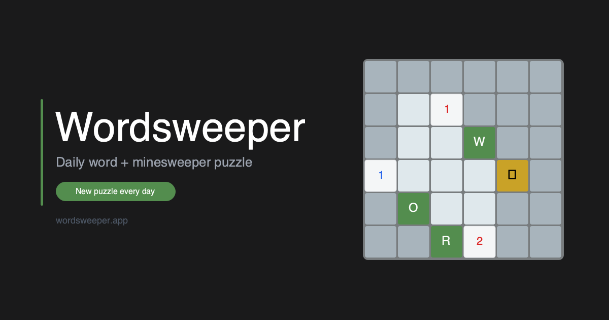

# Wordsweeper

A daily word game that combines Minesweeper with a hidden word puzzle. Reveal cells to collect letters, avoid bombs, then guess the word.

**[Play at wordsweeper.app](https://wordsweeper.app)**

<p align="center">
  
</p>

## How to play

- **Click** a cell to reveal it
- **Right-click** (or long-press on mobile) to flag a cell
- Collect all the hidden letters without hitting 3 bombs
- Once you have all the letters, guess the word
- You can also guess early if you think you know it
- Flag every bomb correctly to earn a perfect bonus

A new puzzle every day.

## Development

```sh
npm install
npm run dev      # localhost:5173
npm run build    # production build → dist/
npm test         # engine tests
```
